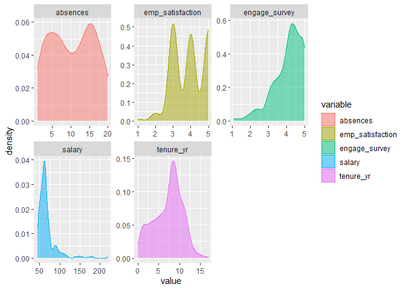
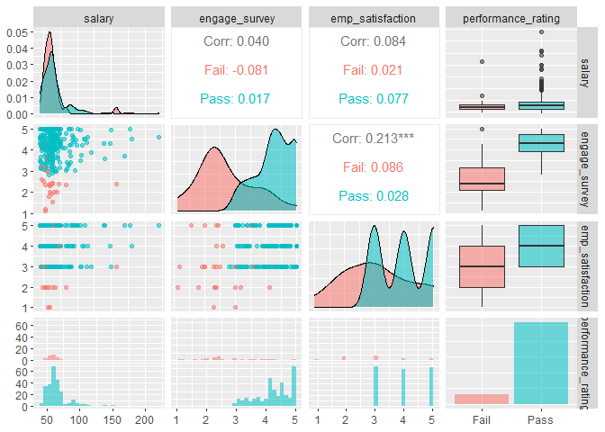
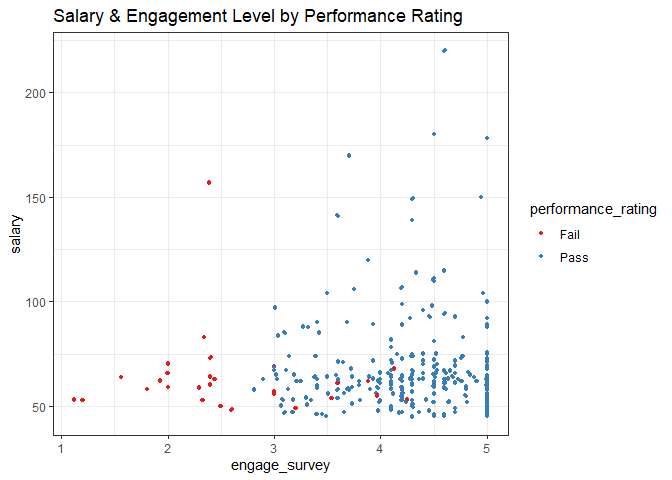
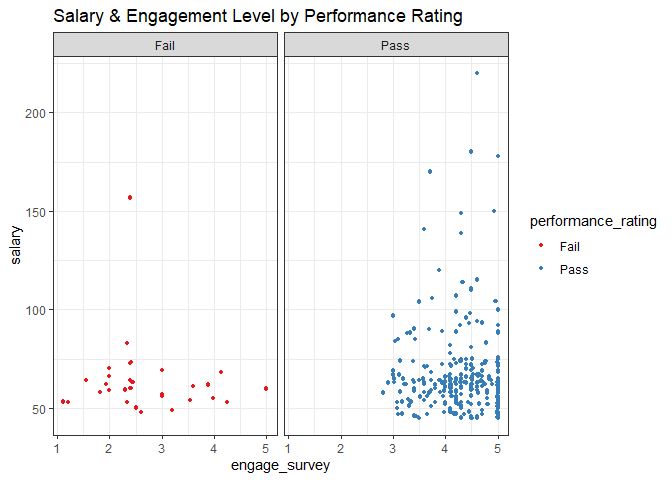
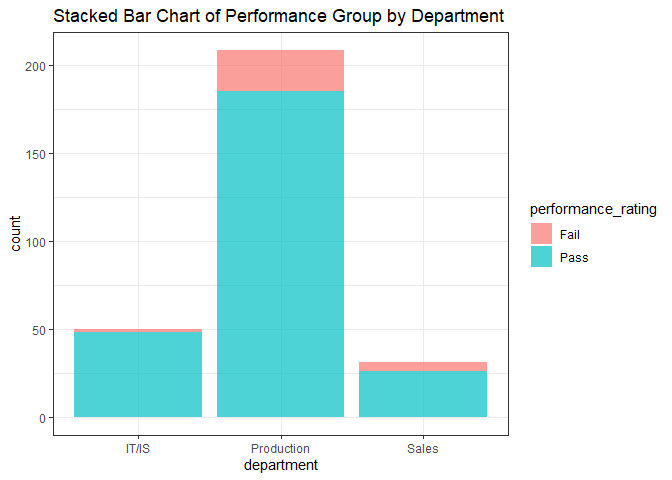
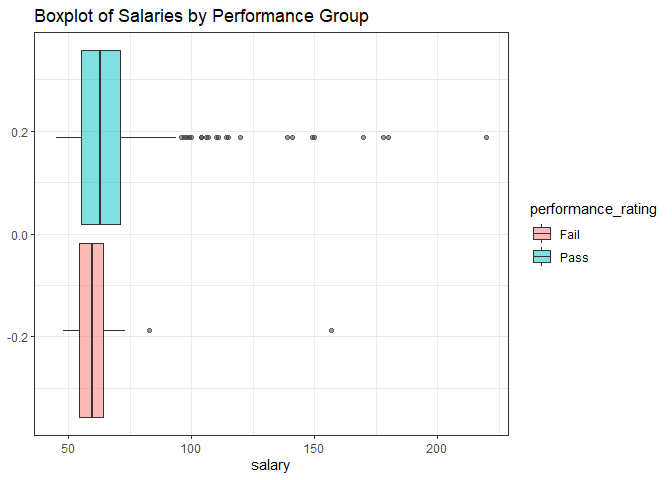
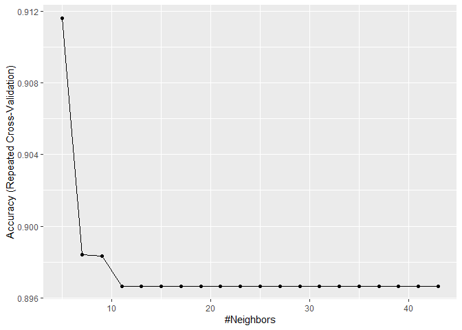

Predicting Employee Performance with KNN Algo
================

#### People Analytics Applications in *R*

##### K-Nearest Neighbors Classifier

------------------------------------------------------------------------

This tutorial will illustrate how to use the **K-Nearest Neighbors
Classifier** in *R* using the *caret* package (Kuhn, 2021). In this
example, our goal is to use a number or HR-related variables to predict
which performance group new employees are likely to fall under.

-   Dataset and codebook can be found on my [github
    page](https://github.com/ggoodwin2022/People-Analytics-in-R)

**NOTE**: If you’re already familiar with EDA & data viz, you can skip
ahead to the **Modeling Pipeline** section

------------------------------------------------------------------------

#### Data Import & Set-Up

``` r
knitr::opts_chunk$set(echo = TRUE)

library(tidyverse)
library(readr)
library(readxl)
library(caret)
library(janitor)
library(DescTools)
library(RColorBrewer)
library(patchwork)
library(sjPlot)
library(GGally)

options(scipen = 999)

hr1 <- read_csv("HR_Sample_Data.csv") # Read in Data

hr1[-c(1,6,7,13)] -> hr1 # Remove predictors we don't need

hr1 %>% 
  map_lgl(is.character) -> char_cols # Identifies Character Variables

hr1[char_cols] %>% 
  map_df(as.factor) -> hr1[char_cols] # Converts to Factors

hr1$salary <- round(hr1$salary/1000, digits = 0) # Salary in Thousands Units
```

------------------------------------------------------------------------

#### Exploratory Data Analysis

Before we begin the modeling process, we need to first take a look at
our dataset to understand its structure, examine important
characteristics such as data missingness, and identify any relevant
trends or relationships.

##### Structure & Descriptive Statistics

``` r
view_df(hr1,show.type = T,
        show.na = T, 
        show.frq = T, 
        show.prc = T, 
        show.values = T)
```

<table style="border-collapse:collapse; border:none;">
<caption>
Data frame: hr1
</caption>
<tr>
<th style="border-bottom:double; font-style:italic; font-weight:normal; padding:0.2cm; text-align:left; vertical-align:top;">
ID
</th>
<th style="border-bottom:double; font-style:italic; font-weight:normal; padding:0.2cm; text-align:left; vertical-align:top;">
Name
</th>
<th style="border-bottom:double; font-style:italic; font-weight:normal; padding:0.2cm; text-align:left; vertical-align:top;">
Type
</th>
<th style="border-bottom:double; font-style:italic; font-weight:normal; padding:0.2cm; text-align:left; vertical-align:top;">
Label
</th>
<th style="border-bottom:double; font-style:italic; font-weight:normal; padding:0.2cm; text-align:left; vertical-align:top;">
missings
</th>
<th style="border-bottom:double; font-style:italic; font-weight:normal; padding:0.2cm; text-align:left; vertical-align:top;">
Values
</th>
<th style="border-bottom:double; font-style:italic; font-weight:normal; padding:0.2cm; text-align:left; vertical-align:top;">
Value Labels
</th>
<th style="border-bottom:double; font-style:italic; font-weight:normal; padding:0.2cm; text-align:left; vertical-align:top;">
Freq.
</th>
<th style="border-bottom:double; font-style:italic; font-weight:normal; padding:0.2cm; text-align:left; vertical-align:top;">
%
</th>
</tr>
<tr>
<td style="padding:0.2cm; text-align:left; vertical-align:top;">
1
</td>
<td style="padding:0.2cm; text-align:left; vertical-align:top;">
salary
</td>
<td style="padding:0.2cm; text-align:left; vertical-align:top;">
numeric
</td>
<td style="padding:0.2cm; text-align:left; vertical-align:top;">
</td>
<td style="padding:0.2cm; text-align:left; vertical-align:top;">
0 (0.00%)
</td>
<td style="padding:0.2cm; text-align:left; vertical-align:top;" colspan="2">
<em>range: 45-220</em>
</td>
<td style="padding:0.2cm; text-align:left; vertical-align:top;">
</td>
<td style="padding:0.2cm; text-align:left; vertical-align:top;">
</td>
</tr>
<tr>
<td style="padding:0.2cm; text-align:left; vertical-align:top; background-color:#eeeeee">
2
</td>
<td style="padding:0.2cm; text-align:left; vertical-align:top; background-color:#eeeeee">
gender
</td>
<td style="padding:0.2cm; text-align:left; vertical-align:top; background-color:#eeeeee">
categorical
</td>
<td style="padding:0.2cm; text-align:left; vertical-align:top; background-color:#eeeeee">
</td>
<td style="padding:0.2cm; text-align:left; vertical-align:top; background-color:#eeeeee">
0 (0.00%)
</td>
<td style="padding:0.2cm; text-align:left; vertical-align:top; background-color:#eeeeee">
</td>
<td style="padding:0.2cm; text-align:left; vertical-align:top; background-color:#eeeeee">
F<br>M
</td>
<td style="padding:0.2cm; text-align:left; vertical-align:top; background-color:#eeeeee">
163<br>126
</td>
<td style="padding:0.2cm; text-align:left; vertical-align:top; background-color:#eeeeee">
56.40<br>43.60
</td>
</tr>
<tr>
<td style="padding:0.2cm; text-align:left; vertical-align:top;">
3
</td>
<td style="padding:0.2cm; text-align:left; vertical-align:top;">
marital_desc
</td>
<td style="padding:0.2cm; text-align:left; vertical-align:top;">
categorical
</td>
<td style="padding:0.2cm; text-align:left; vertical-align:top;">
</td>
<td style="padding:0.2cm; text-align:left; vertical-align:top;">
0 (0.00%)
</td>
<td style="padding:0.2cm; text-align:left; vertical-align:top;">
</td>
<td style="padding:0.2cm; text-align:left; vertical-align:top;">
Divorced<br>Married<br>Separated<br>Single<br>Widowed
</td>
<td style="padding:0.2cm; text-align:left; vertical-align:top;">
29<br>114<br>12<br>126<br>8
</td>
<td style="padding:0.2cm; text-align:left; vertical-align:top;">
10.03<br>39.45<br>4.15<br>43.60<br>2.77
</td>
</tr>
<tr>
<td style="padding:0.2cm; text-align:left; vertical-align:top; background-color:#eeeeee">
4
</td>
<td style="padding:0.2cm; text-align:left; vertical-align:top; background-color:#eeeeee">
hispanic_latino
</td>
<td style="padding:0.2cm; text-align:left; vertical-align:top; background-color:#eeeeee">
categorical
</td>
<td style="padding:0.2cm; text-align:left; vertical-align:top; background-color:#eeeeee">
</td>
<td style="padding:0.2cm; text-align:left; vertical-align:top; background-color:#eeeeee">
0 (0.00%)
</td>
<td style="padding:0.2cm; text-align:left; vertical-align:top; background-color:#eeeeee">
</td>
<td style="padding:0.2cm; text-align:left; vertical-align:top; background-color:#eeeeee">
No<br>Yes
</td>
<td style="padding:0.2cm; text-align:left; vertical-align:top; background-color:#eeeeee">
263<br>26
</td>
<td style="padding:0.2cm; text-align:left; vertical-align:top; background-color:#eeeeee">
91.00<br>9.00
</td>
</tr>
<tr>
<td style="padding:0.2cm; text-align:left; vertical-align:top;">
5
</td>
<td style="padding:0.2cm; text-align:left; vertical-align:top;">
emp_status
</td>
<td style="padding:0.2cm; text-align:left; vertical-align:top;">
categorical
</td>
<td style="padding:0.2cm; text-align:left; vertical-align:top;">
</td>
<td style="padding:0.2cm; text-align:left; vertical-align:top;">
0 (0.00%)
</td>
<td style="padding:0.2cm; text-align:left; vertical-align:top;">
</td>
<td style="padding:0.2cm; text-align:left; vertical-align:top;">
Active<br>Terminated for Cause<br>Voluntarily Terminated
</td>
<td style="padding:0.2cm; text-align:left; vertical-align:top;">
191<br>14<br>84
</td>
<td style="padding:0.2cm; text-align:left; vertical-align:top;">
66.09<br>4.84<br>29.07
</td>
</tr>
<tr>
<td style="padding:0.2cm; text-align:left; vertical-align:top; background-color:#eeeeee">
6
</td>
<td style="padding:0.2cm; text-align:left; vertical-align:top; background-color:#eeeeee">
department
</td>
<td style="padding:0.2cm; text-align:left; vertical-align:top; background-color:#eeeeee">
categorical
</td>
<td style="padding:0.2cm; text-align:left; vertical-align:top; background-color:#eeeeee">
</td>
<td style="padding:0.2cm; text-align:left; vertical-align:top; background-color:#eeeeee">
0 (0.00%)
</td>
<td style="padding:0.2cm; text-align:left; vertical-align:top; background-color:#eeeeee">
</td>
<td style="padding:0.2cm; text-align:left; vertical-align:top; background-color:#eeeeee">
IT/IS<br>Production<br>Sales
</td>
<td style="padding:0.2cm; text-align:left; vertical-align:top; background-color:#eeeeee">
50<br>208<br>31
</td>
<td style="padding:0.2cm; text-align:left; vertical-align:top; background-color:#eeeeee">
17.30<br>71.97<br>10.73
</td>
</tr>
<tr>
<td style="padding:0.2cm; text-align:left; vertical-align:top;">
7
</td>
<td style="padding:0.2cm; text-align:left; vertical-align:top;">
performance_rating
</td>
<td style="padding:0.2cm; text-align:left; vertical-align:top;">
categorical
</td>
<td style="padding:0.2cm; text-align:left; vertical-align:top;">
</td>
<td style="padding:0.2cm; text-align:left; vertical-align:top;">
0 (0.00%)
</td>
<td style="padding:0.2cm; text-align:left; vertical-align:top;">
</td>
<td style="padding:0.2cm; text-align:left; vertical-align:top;">
Fail<br>Pass
</td>
<td style="padding:0.2cm; text-align:left; vertical-align:top;">
30<br>259
</td>
<td style="padding:0.2cm; text-align:left; vertical-align:top;">
10.38<br>89.62
</td>
</tr>
<tr>
<td style="padding:0.2cm; text-align:left; vertical-align:top; background-color:#eeeeee">
8
</td>
<td style="padding:0.2cm; text-align:left; vertical-align:top; background-color:#eeeeee">
engage_survey
</td>
<td style="padding:0.2cm; text-align:left; vertical-align:top; background-color:#eeeeee">
numeric
</td>
<td style="padding:0.2cm; text-align:left; vertical-align:top; background-color:#eeeeee">
</td>
<td style="padding:0.2cm; text-align:left; vertical-align:top; background-color:#eeeeee">
0 (0.00%)
</td>
<td style="padding:0.2cm; text-align:left; vertical-align:top; background-color:#eeeeee" colspan="2">
<em>range: 1.1-5.0</em>
</td>
<td style="padding:0.2cm; text-align:left; vertical-align:top; background-color:#eeeeee">
</td>
<td style="padding:0.2cm; text-align:left; vertical-align:top; background-color:#eeeeee">
</td>
</tr>
<tr>
<td style="padding:0.2cm; text-align:left; vertical-align:top;">
9
</td>
<td style="padding:0.2cm; text-align:left; vertical-align:top;">
emp_satisfaction
</td>
<td style="padding:0.2cm; text-align:left; vertical-align:top;">
numeric
</td>
<td style="padding:0.2cm; text-align:left; vertical-align:top;">
</td>
<td style="padding:0.2cm; text-align:left; vertical-align:top;">
0 (0.00%)
</td>
<td style="padding:0.2cm; text-align:left; vertical-align:top;" colspan="2">
<em>range: 1-5</em>
</td>
<td style="padding:0.2cm; text-align:left; vertical-align:top;">
</td>
<td style="padding:0.2cm; text-align:left; vertical-align:top;">
</td>
</tr>
<tr>
<td style="padding:0.2cm; text-align:left; vertical-align:top; background-color:#eeeeee">
10
</td>
<td style="padding:0.2cm; text-align:left; vertical-align:top; background-color:#eeeeee">
absences
</td>
<td style="padding:0.2cm; text-align:left; vertical-align:top; background-color:#eeeeee">
numeric
</td>
<td style="padding:0.2cm; text-align:left; vertical-align:top; background-color:#eeeeee">
</td>
<td style="padding:0.2cm; text-align:left; vertical-align:top; background-color:#eeeeee">
0 (0.00%)
</td>
<td style="padding:0.2cm; text-align:left; vertical-align:top; background-color:#eeeeee" colspan="2">
<em>range: 1-20</em>
</td>
<td style="padding:0.2cm; text-align:left; vertical-align:top; background-color:#eeeeee">
</td>
<td style="padding:0.2cm; text-align:left; vertical-align:top; background-color:#eeeeee">
</td>
</tr>
<tr>
<td style="padding:0.2cm; text-align:left; vertical-align:top;">
11
</td>
<td style="padding:0.2cm; text-align:left; vertical-align:top;">
tenure_yr
</td>
<td style="padding:0.2cm; text-align:left; vertical-align:top;">
numeric
</td>
<td style="padding:0.2cm; text-align:left; vertical-align:top;">
</td>
<td style="padding:0.2cm; text-align:left; vertical-align:top;">
0 (0.00%)
</td>
<td style="padding:0.2cm; text-align:left; vertical-align:top;" colspan="2">
<em>range: 0-17</em>
</td>
<td style="padding:0.2cm; text-align:left; vertical-align:top;">
</td>
<td style="padding:0.2cm; text-align:left; vertical-align:top;">
</td>
</tr>
</table>

``` r
summary(hr1)
```

    ##      salary       gender     marital_desc hispanic_latino
    ##  Min.   : 45.00   F:163   Divorced : 29   No :263        
    ##  1st Qu.: 55.00   M:126   Married  :114   Yes: 26        
    ##  Median : 62.00           Separated: 12                  
    ##  Mean   : 67.26           Single   :126                  
    ##  3rd Qu.: 70.00           Widowed  :  8                  
    ##  Max.   :220.00                                          
    ##                   emp_status       department  performance_rating
    ##  Active                :191   IT/IS     : 50   Fail: 30          
    ##  Terminated for Cause  : 14   Production:208   Pass:259          
    ##  Voluntarily Terminated: 84   Sales     : 31                     
    ##                                                                  
    ##                                                                  
    ##                                                                  
    ##  engage_survey  emp_satisfaction    absences       tenure_yr    
    ##  Min.   :1.12   Min.   :1.0      Min.   : 1.00   Min.   : 0.00  
    ##  1st Qu.:3.66   1st Qu.:3.0      1st Qu.: 5.00   1st Qu.: 5.00  
    ##  Median :4.28   Median :4.0      Median :11.00   Median : 8.00  
    ##  Mean   :4.10   Mean   :3.9      Mean   :10.37   Mean   : 7.27  
    ##  3rd Qu.:4.70   3rd Qu.:5.0      3rd Qu.:15.00   3rd Qu.: 9.00  
    ##  Max.   :5.00   Max.   :5.0      Max.   :20.00   Max.   :17.00

------------------------------------------------------------------------

**Some important characteristics to look for:**

-   **Data Missingness**
    -   we have 0% missingness on all variables
-   **Frequency/Distribution**
    -   Marital Desc variable may present a challenge
        -   Freqs are very uneven across factor levels
    -   Our Performance Rating outcome has a 90:10 ratio
        -   This is okay, but be wary of very uneven outcome classes,
            especially when sample size is low
-   **Data Types & Structure**
    -   All of our categorical & numeric variables are properly coded as
        such

------------------------------------------------------------------------

##### Data Visualization

###### Univariate Plots

The code below selects all the numeric variables in your dataset, pivots
to long form, and then creates a ggplot faceted by each variable type. I
highly recommend running the code one line at a time to see how it
works. Note that the **geom_density** can be changed.

``` r
hr1 %>%
  select_if(is.numeric) %>% 
  pivot_longer(names_to = "variable",
               values_to = "value",
               cols = 1:5) %>% 
  ggplot(aes(x = value,
             color = variable,
             fill = variable)) +
  facet_wrap(~ variable, scales = "free") +
  geom_density(alpha = 0.5)
```

<!-- -->

###### Multivariate Plots

For modeling relationships amongst our variables, the **GGally** package
has a fantastic function called **ggpairs**, shown below.

``` r
hr1 %>% 
  select(c(salary,
           engage_survey,
           emp_satisfaction,
           performance_rating)) %>% 
  ggpairs(aes(colour = performance_rating, alpha = 0.4))
```

    ## `stat_bin()` using `bins = 30`. Pick better value with `binwidth`.
    ## `stat_bin()` using `bins = 30`. Pick better value with `binwidth`.
    ## `stat_bin()` using `bins = 30`. Pick better value with `binwidth`.

<!-- -->

We can also recreate the same plots ourselves:

``` r
ggplot(data = hr1, 
       aes(x = engage_survey,
           y = salary,
           color = performance_rating)) +
  geom_point(size = 0.9) +
  geom_jitter(size = 0.9) +
  scale_color_brewer(palette = "Set1") +
  theme_bw() + 
  labs(title = "Salary & Engagement Level by Performance Rating")
```

<!-- -->

``` r
ggplot(data = hr1, 
       aes(x = engage_survey,
           y = salary,
           color = performance_rating)) +
  geom_point(size = 0.9) +
  geom_jitter(size = 0.9) +
  facet_wrap(~performance_rating) +
  scale_color_brewer(palette = "Set1") +
  theme_bw() + 
  labs(title = "Salary & Engagement Level by Performance Rating")
```

<!-- -->

``` r
ggplot(data = hr1, 
       aes(x = department,
           fill = performance_rating)) +
  geom_bar(alpha = 0.7) +
  theme_bw() +
  labs(title = "Stacked Bar Chart of Performance Group by Department")
```

<!-- -->

``` r
ggplot(data = hr1, 
       aes(x = salary,
           fill = performance_rating)) +
  geom_boxplot(alpha = 0.5) +
  theme_bw() +
  labs(title = "Boxplot of Salaries by Performance Group")
```

<!-- -->

------------------------------------------------------------------------

#### Modeling Pipeline

With the *caret* package, there are a few different ways we can approach
our modeling pipeline. Because this is a tutorial, I’m going to show the
longer version where each step is explicitly carried out one at a time.

------------------------------------------------------------------------

##### Data Pre-Processing

We have a couple of data pre-processing steps we need to carry out.

-   Create Dummy Vars for our categorical predictors
    -   e.g., Convert a 5-level categorical variable to 4 dummy vars
-   Normalize/scale our predictors so they are all on the same scale
    -   VERY important w/KNN or any other distance-based algorithms

###### Design Matrix/Data Frame including Categorical Vars

In this step we’ll create a feature/design matrix where all our
variables are represented numerically.

``` r
# Categorical to Dummy via Base R Model Matrix
model.matrix(performance_rating ~ ., 
             data = hr1) -> X_mat

X_df <- data.frame(X_mat[,-1]) # Convert matrix to DF, remove Intercept

head(X_df)
```

    ##   salary genderM marital_descMarried marital_descSeparated marital_descSingle
    ## 1     63       1                   0                     0                  1
    ## 2    104       1                   1                     0                  0
    ## 3     65       0                   1                     0                  0
    ## 4     65       0                   1                     0                  0
    ## 5     51       0                   0                     0                  0
    ## 6     58       0                   0                     0                  1
    ##   marital_descWidowed hispanic_latinoYes emp_statusTerminated.for.Cause
    ## 1                   0                  0                              0
    ## 2                   0                  0                              0
    ## 3                   0                  0                              0
    ## 4                   0                  0                              0
    ## 5                   0                  0                              0
    ## 6                   0                  0                              0
    ##   emp_statusVoluntarily.Terminated departmentProduction departmentSales
    ## 1                                0                    1               0
    ## 2                                1                    0               0
    ## 3                                1                    1               0
    ## 4                                0                    1               0
    ## 5                                1                    1               0
    ## 6                                0                    1               0
    ##   engage_survey emp_satisfaction absences tenure_yr
    ## 1          4.60                5        1        11
    ## 2          4.96                3       17         1
    ## 3          3.02                3        3         1
    ## 4          4.84                5       15        15
    ## 5          5.00                4        2         5
    ## 6          5.00                5       15        11

###### Center & Scale/Normalize Predictors

Now we need to rescale all of our predictors so that variables with
larger scales don’t have undue influence. We’ll do this via
**preProcess**.

Note that the **preProcess** function doesn’t actually *transform* our
predictors yet, it just establishes the transformation method. It also
gives a summary of which variables were impacted:

``` r
# Center and Scale


preproc_X <- preProcess(x = X_df,
                       method = c("center", "scale"))

preproc_X
```

    ## Created from 289 samples and 15 variables
    ## 
    ## Pre-processing:
    ##   - centered (15)
    ##   - ignored (0)
    ##   - scaled (15)

We use the **predict** function to actually “predict” the transformed
values using our established tranformation method:

``` r
X_scaled <- predict(preproc_X, newdata = X_df) # TRANSFORM   


# Append performance outcome back onto Feature matrix
hr1_scaled <- cbind(hr1["performance_rating"],X_scaled)

hr1_scaled %>% 
  relocate(performance_rating,
           .before = salary) -> hr1_scaled

head(hr1_scaled)
```

    ##   performance_rating      salary    genderM marital_descMarried
    ## 1               Pass -0.18638973  1.1354182          -0.8057137
    ## 2               Pass  1.60916463  1.1354182           1.2368411
    ## 3               Pass -0.09880171 -0.8776852           1.2368411
    ## 4               Pass -0.09880171 -0.8776852           1.2368411
    ## 5               Pass -0.71191783 -0.8776852          -0.8057137
    ## 6               Pass -0.40535977 -0.8776852          -0.8057137
    ##   marital_descSeparated marital_descSingle marital_descWidowed
    ## 1            -0.2077773          1.1354182          -0.1684376
    ## 2            -0.2077773         -0.8776852          -0.1684376
    ## 3            -0.2077773         -0.8776852          -0.1684376
    ## 4            -0.2077773         -0.8776852          -0.1684376
    ## 5            -0.2077773         -0.8776852          -0.1684376
    ## 6            -0.2077773          1.1354182          -0.1684376
    ##   hispanic_latinoYes emp_statusTerminated.for.Cause
    ## 1         -0.3138746                     -0.2252397
    ## 2         -0.3138746                     -0.2252397
    ## 3         -0.3138746                     -0.2252397
    ## 4         -0.3138746                     -0.2252397
    ## 5         -0.3138746                     -0.2252397
    ## 6         -0.3138746                     -0.2252397
    ##   emp_statusVoluntarily.Terminated departmentProduction departmentSales
    ## 1                       -0.6390135            0.6229571      -0.3460336
    ## 2                        1.5594972           -1.5996924      -0.3460336
    ## 3                        1.5594972            0.6229571      -0.3460336
    ## 4                       -0.6390135            0.6229571      -0.3460336
    ## 5                        1.5594972            0.6229571      -0.3460336
    ## 6                       -0.6390135            0.6229571      -0.3460336
    ##   engage_survey emp_satisfaction   absences  tenure_yr
    ## 1     0.6308783        1.2101939 -1.6157120  1.0978038
    ## 2     1.0847652       -0.9894667  1.1421515 -1.8452880
    ## 3    -1.3611807       -0.9894667 -1.2709791 -1.8452880
    ## 4     0.9334696        1.2101939  0.7974186  2.2750405
    ## 5     1.1351971        0.1103636 -1.4433456 -0.6680513
    ## 6     1.1351971        1.2101939  0.7974186  1.0978038

------------------------------------------------------------------------

##### Data Partition into Train & Test

We’ll use caret’s **createDataPartition** to split our main dataset into
a training and testing set

-   Set seed for reproducibility
-   Stratify w/respect to the outcome (tell it what “y” is)
-   Specify the split ratio (p = training %, 70:30 split used below)

``` r
set.seed(825) # Set Seed

# Create index for split
index_trn <- createDataPartition(y = hr1_scaled$performance_rating, 
                                 p = .7, 
                                 list = FALSE,
                                 times = 1)

# Use index to create train & test subsets
hr_trn <- hr1_scaled[index_trn,]
hr_test <- hr1_scaled[-index_trn,]
```

------------------------------------------------------------------------

##### Hyperparameter Tuning

The *caret* package’s **trnControl** function allows you to choose the
manner in which you want your hyperparameters to be tuned. There are a
LOT of different customization options, but a simple default is to use
**repeated k-fold cross-validation**.

For the KNN model, we need to tune for the optimal selection of **k**.
We’ll do so using an accuracy-based 10-fold cross-validation repeated 3x

``` r
# We'll use 10-fold CV repeated 3x
trn_Control <- trainControl(method = "repeatedcv",
                            number = 10,
                            repeats = 3)
```

It’s important to note that as with the **preProcess** step, the tuning
doesn’t actually occur via **trainControl**, that’s just how we
*specify* the *tuning method* The actual tuning is conducted alongside
the model training step.

------------------------------------------------------------------------

##### Model Training

We use *caret’s* **train** function to create our fitted model.

-   Specify formula
    -   **Y \~ . ** if all predictors included
    -   (Y = salary + engage + …) if specific predictors included
-   Specify training data
    -   **data** = hr_trn for this example
-   Specify model family via model method
    -   **method** = “knn” for KNN
    -   different models have different tags to specify
        -   **names(getModelInfo())** will give a list of all models
-   Specify name of **tuning method** created above
    -   **trControl** = trn_Control

After fitting your model, printing the fitted object will give an
overview of the model selected, along with the optimal hyperparameter
values chosen

``` r
# Create fitted model
knn_fit1 <- train(performance_rating ~ ., 
                  data = hr_trn,
                  method = "knn", 
                  trControl = trn_Control,
                  tuneLength = 20)

knn_fit1 # Overview
```

    ## k-Nearest Neighbors 
    ## 
    ## 203 samples
    ##  15 predictor
    ##   2 classes: 'Fail', 'Pass' 
    ## 
    ## No pre-processing
    ## Resampling: Cross-Validated (10 fold, repeated 3 times) 
    ## Summary of sample sizes: 182, 182, 183, 183, 183, 182, ... 
    ## Resampling results across tuning parameters:
    ## 
    ##   k   Accuracy   Kappa     
    ##    5  0.9115873  0.23502923
    ##    7  0.8984127  0.05964487
    ##    9  0.8983333  0.02142857
    ##   11  0.8966667  0.00000000
    ##   13  0.8966667  0.00000000
    ##   15  0.8966667  0.00000000
    ##   17  0.8966667  0.00000000
    ##   19  0.8966667  0.00000000
    ##   21  0.8966667  0.00000000
    ##   23  0.8966667  0.00000000
    ##   25  0.8966667  0.00000000
    ##   27  0.8966667  0.00000000
    ##   29  0.8966667  0.00000000
    ##   31  0.8966667  0.00000000
    ##   33  0.8966667  0.00000000
    ##   35  0.8966667  0.00000000
    ##   37  0.8966667  0.00000000
    ##   39  0.8966667  0.00000000
    ##   41  0.8966667  0.00000000
    ##   43  0.8966667  0.00000000
    ## 
    ## Accuracy was used to select the optimal model using the largest value.
    ## The final value used for the model was k = 5.

We can also plot the hyperparameter tuning process:

``` r
ggplot(knn_fit1) # Plot Hyperparameter tuning 
```

<!-- -->

We can also get a summary of the *final model*. This is kind of
pointless for KNN, but is very useful for algorithms like the
RandomForest, where we might want to see what the final decision rules
were:

``` r
knn_fit1$finalModel
```

    ## 5-nearest neighbor model
    ## Training set outcome distribution:
    ## 
    ## Fail Pass 
    ##   21  182

Finally, we can examine **variable importance**:

``` r
varImp(knn_fit1)
```

    ## ROC curve variable importance
    ## 
    ##                                  Importance
    ## engage_survey                       100.000
    ## emp_satisfaction                     39.579
    ## emp_statusTerminated.for.Cause       23.280
    ## genderM                              18.439
    ## tenure_yr                            11.228
    ## marital_descMarried                  10.372
    ## salary                                8.594
    ## marital_descSingle                    6.915
    ## emp_statusVoluntarily.Terminated      4.149
    ## hispanic_latinoYes                    3.918
    ## departmentSales                       2.996
    ## marital_descWidowed                   2.305
    ## departmentProduction                  2.074
    ## absences                              1.449
    ## marital_descSeparated                 0.000

------------------------------------------------------------------------

##### Evaluating Predictive Performance

Now that we’ve fit out model, it’s time to evaluate it’s **predictive
performance**. First we need to generate predictions using our test set.

###### Generating Predictions for Test Set

-   Specify the **fitted object** = fitted model name
-   Specify the **newdata** = testing set name
-   Specify the **type** of prediction (raw or probabilistic)

First we’ll generate **probabilistic predictions**, where we’re given a
probability estimate for each outcome class

``` r
# Probabilistic Preds first
knn_pred_prob1 <- predict(knn_fit1, 
                       newdata = hr_test, 
                       type="prob")

head(knn_pred_prob1)
```

    ##   Fail Pass
    ## 1  0.0  1.0
    ## 2  0.0  1.0
    ## 3  0.2  0.8
    ## 4  0.0  1.0
    ## 5  0.2  0.8
    ## 6  0.2  0.8

Next we’ll generate “raw” predictions, or **fitted values**, where we
get a simple class membership prediction rather than a probabilistic
estimate.

``` r
# "Raw"/Fitted Preds Second
knn_pred_fitted1<-predict(knn_fit1, 
                          newdata=hr_test,
                          type = "raw")

head(knn_pred_fitted1)
```

    ## [1] Pass Pass Pass Pass Pass Pass
    ## Levels: Fail Pass

###### Evaluating Performance

Next we’ll compare the predictions generated to the **actual** test set
performance group values.

-   It only makes sense to do this for the “raw” predictions
    -   Specify **pred** = predictions generated
    -   Specify **obs** = actual test set outcome values

``` r
# Evaluate Predictive Performance upon Test Set
postResample(pred = knn_pred_fitted1, 
             obs = hr_test$performance_rating)
```

    ##  Accuracy     Kappa 
    ## 0.9186047 0.3384615

We see that when used upon our testing set, our KNN model yields an
accuracy of \~92%. Not bad!

We can also generate a **Confusion Matrix**

-   Specify **data** = fitted prediction object
-   Specify **reference** = actual test set outcome values

``` r
# Confusion Matrix
confusionMatrix(data = knn_pred_fitted1,
                reference = hr_test$performance_rating)
```

    ## Confusion Matrix and Statistics
    ## 
    ##           Reference
    ## Prediction Fail Pass
    ##       Fail    2    0
    ##       Pass    7   77
    ##                                           
    ##                Accuracy : 0.9186          
    ##                  95% CI : (0.8395, 0.9666)
    ##     No Information Rate : 0.8953          
    ##     P-Value [Acc > NIR] : 0.31087         
    ##                                           
    ##                   Kappa : 0.3385          
    ##                                           
    ##  Mcnemar's Test P-Value : 0.02334         
    ##                                           
    ##             Sensitivity : 0.22222         
    ##             Specificity : 1.00000         
    ##          Pos Pred Value : 1.00000         
    ##          Neg Pred Value : 0.91667         
    ##              Prevalence : 0.10465         
    ##          Detection Rate : 0.02326         
    ##    Detection Prevalence : 0.02326         
    ##       Balanced Accuracy : 0.61111         
    ##                                           
    ##        'Positive' Class : Fail            
    ## 

It looks like our model does a really good job of predicting the
high-performers, but not so great at predicting the low-performers.

------------------------------------------------------------------------

##### Recap

We’ve covered the following steps:

-   **Exploratory Data Analysis**
    -   Data Structure
    -   Data Viz
-   **Data Pre-Processing**
    -   Center & Scale/Normalize
-   **Data Partitioning**
    -   70:30 Train/Test Split
-   **Hyperparameter Tuning**
    -   Selecting optimal value of *k*
-   **Model Fitting/Training**
    -   Create fitted model object

6)  **Predictive Performance**

-   Generate test set performance predictions
-   Compare predictions to actual outcomes
-   Create Confusion Matrix to slice/dice accuracy issues

------------------------------------------------------------------------

Thanks for reading! Please feel free to reach out with any questions
