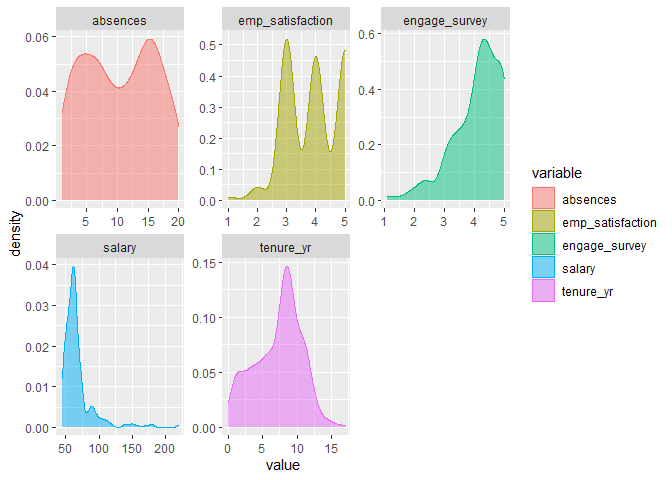
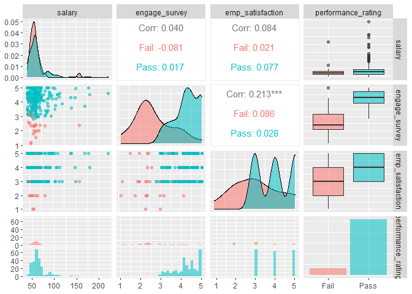
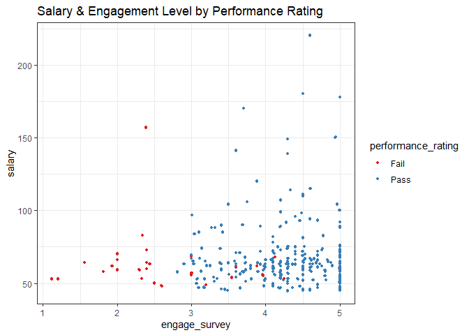
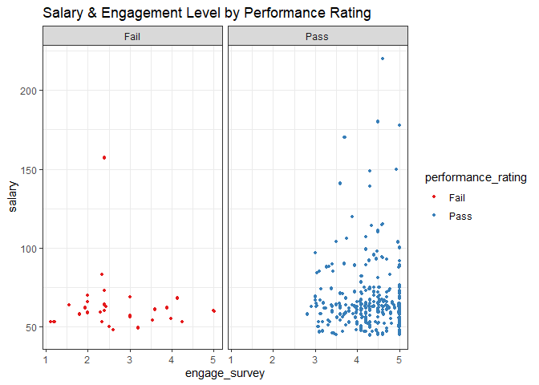
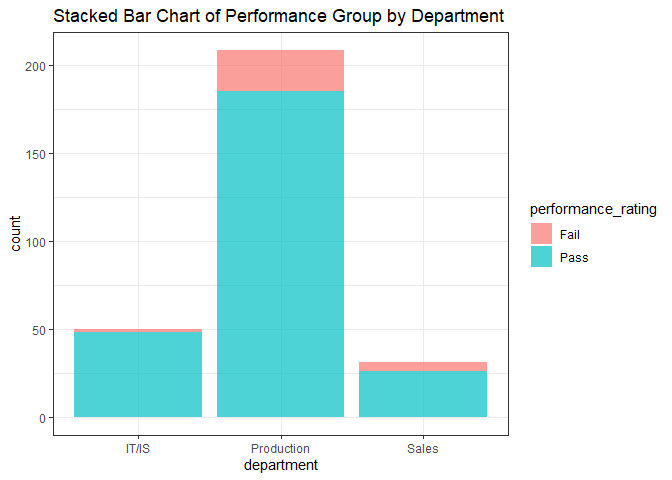
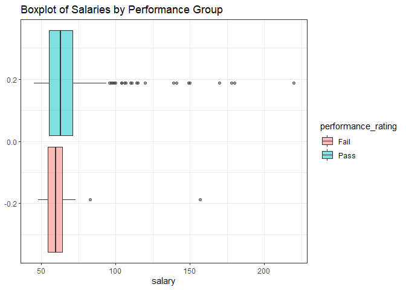
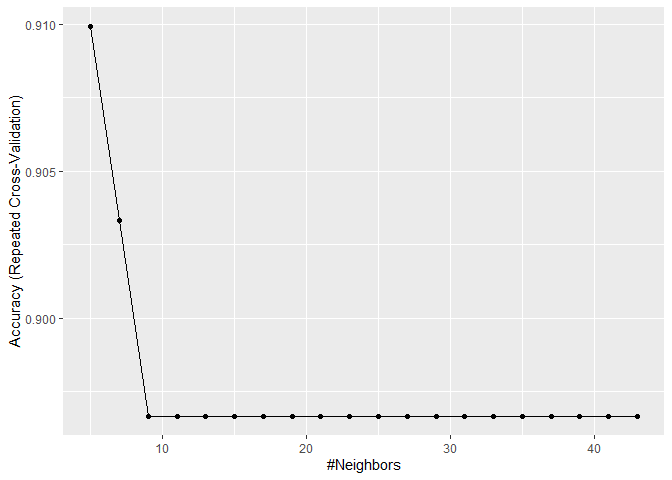

Predicting Employee Performance with KNN Algo
================

#### People Analytics Applications in *R*

##### K-Nearest Neighbors Classifier

------------------------------------------------------------------------

This tutorial will illustrate how to use the **K-Nearest Neighbors
Classifier** in *R* using the *caret* package (Kuhn, 2021). In this
example, our goal is to use a number or HR-related variables to predict
which performance group new employees are likely to fall under.

-   Dataset and codebook can be found on my [github
    page](https://github.com/ggoodwin2022/People-Analytics-in-R)

**NOTE**: If you’re already familiar with EDA & data viz, you can skip
ahead to the **Modeling Pipeline** section

------------------------------------------------------------------------

#### Data Import & Set-Up

``` r
knitr::opts_chunk$set(echo = TRUE)

library(tidyverse)
library(readr)
library(readxl)
library(caret)
library(janitor)
library(DescTools)
library(RColorBrewer)
library(patchwork)
library(sjPlot)
library(GGally)

options(scipen = 999)

hr1 <- read_csv("HR_Sample_Data.csv") # Read in Data

hr1[-c(1,6,7,13)] -> hr1 # Remove predictors we don't need

hr1 %>% 
  map_lgl(is.character) -> char_cols # Identifies Character Variables

hr1[char_cols] %>% 
  map_df(as.factor) -> hr1[char_cols] # Converts to Factors

hr1$salary <- round(hr1$salary/1000, digits = 0) # Salary in Thousands Units
```

------------------------------------------------------------------------

#### Exploratory Data Analysis

Before we begin the modeling process, we need to first take a look at
our dataset to understand its structure, examine important
characteristics such as data missingness, and identify any relevant
trends or relationships.

##### Structure & Descriptive Statistics

``` r
view_df(hr1,show.type = T,
        show.na = T, 
        show.frq = T, 
        show.prc = T, 
        show.values = T)
```

<table style="border-collapse:collapse; border:none;">
<caption>
Data frame: hr1
</caption>
<tr>
<th style="border-bottom:double; font-style:italic; font-weight:normal; padding:0.2cm; text-align:left; vertical-align:top;">
ID
</th>
<th style="border-bottom:double; font-style:italic; font-weight:normal; padding:0.2cm; text-align:left; vertical-align:top;">
Name
</th>
<th style="border-bottom:double; font-style:italic; font-weight:normal; padding:0.2cm; text-align:left; vertical-align:top;">
Type
</th>
<th style="border-bottom:double; font-style:italic; font-weight:normal; padding:0.2cm; text-align:left; vertical-align:top;">
Label
</th>
<th style="border-bottom:double; font-style:italic; font-weight:normal; padding:0.2cm; text-align:left; vertical-align:top;">
missings
</th>
<th style="border-bottom:double; font-style:italic; font-weight:normal; padding:0.2cm; text-align:left; vertical-align:top;">
Values
</th>
<th style="border-bottom:double; font-style:italic; font-weight:normal; padding:0.2cm; text-align:left; vertical-align:top;">
Value Labels
</th>
<th style="border-bottom:double; font-style:italic; font-weight:normal; padding:0.2cm; text-align:left; vertical-align:top;">
Freq.
</th>
<th style="border-bottom:double; font-style:italic; font-weight:normal; padding:0.2cm; text-align:left; vertical-align:top;">
%
</th>
</tr>
<tr>
<td style="padding:0.2cm; text-align:left; vertical-align:top;">
1
</td>
<td style="padding:0.2cm; text-align:left; vertical-align:top;">
salary
</td>
<td style="padding:0.2cm; text-align:left; vertical-align:top;">
numeric
</td>
<td style="padding:0.2cm; text-align:left; vertical-align:top;">
</td>
<td style="padding:0.2cm; text-align:left; vertical-align:top;">
0 (0.00%)
</td>
<td style="padding:0.2cm; text-align:left; vertical-align:top;" colspan="2">
<em>range: 45-220</em>
</td>
<td style="padding:0.2cm; text-align:left; vertical-align:top;">
</td>
<td style="padding:0.2cm; text-align:left; vertical-align:top;">
</td>
</tr>
<tr>
<td style="padding:0.2cm; text-align:left; vertical-align:top; background-color:#eeeeee">
2
</td>
<td style="padding:0.2cm; text-align:left; vertical-align:top; background-color:#eeeeee">
gender
</td>
<td style="padding:0.2cm; text-align:left; vertical-align:top; background-color:#eeeeee">
categorical
</td>
<td style="padding:0.2cm; text-align:left; vertical-align:top; background-color:#eeeeee">
</td>
<td style="padding:0.2cm; text-align:left; vertical-align:top; background-color:#eeeeee">
0 (0.00%)
</td>
<td style="padding:0.2cm; text-align:left; vertical-align:top; background-color:#eeeeee">
</td>
<td style="padding:0.2cm; text-align:left; vertical-align:top; background-color:#eeeeee">
F<br>M
</td>
<td style="padding:0.2cm; text-align:left; vertical-align:top; background-color:#eeeeee">
163<br>126
</td>
<td style="padding:0.2cm; text-align:left; vertical-align:top; background-color:#eeeeee">
56.40<br>43.60
</td>
</tr>
<tr>
<td style="padding:0.2cm; text-align:left; vertical-align:top;">
3
</td>
<td style="padding:0.2cm; text-align:left; vertical-align:top;">
marital_desc
</td>
<td style="padding:0.2cm; text-align:left; vertical-align:top;">
categorical
</td>
<td style="padding:0.2cm; text-align:left; vertical-align:top;">
</td>
<td style="padding:0.2cm; text-align:left; vertical-align:top;">
0 (0.00%)
</td>
<td style="padding:0.2cm; text-align:left; vertical-align:top;">
</td>
<td style="padding:0.2cm; text-align:left; vertical-align:top;">
Divorced<br>Married<br>Separated<br>Single<br>Widowed
</td>
<td style="padding:0.2cm; text-align:left; vertical-align:top;">
29<br>114<br>12<br>126<br>8
</td>
<td style="padding:0.2cm; text-align:left; vertical-align:top;">
10.03<br>39.45<br>4.15<br>43.60<br>2.77
</td>
</tr>
<tr>
<td style="padding:0.2cm; text-align:left; vertical-align:top; background-color:#eeeeee">
4
</td>
<td style="padding:0.2cm; text-align:left; vertical-align:top; background-color:#eeeeee">
hispanic_latino
</td>
<td style="padding:0.2cm; text-align:left; vertical-align:top; background-color:#eeeeee">
categorical
</td>
<td style="padding:0.2cm; text-align:left; vertical-align:top; background-color:#eeeeee">
</td>
<td style="padding:0.2cm; text-align:left; vertical-align:top; background-color:#eeeeee">
0 (0.00%)
</td>
<td style="padding:0.2cm; text-align:left; vertical-align:top; background-color:#eeeeee">
</td>
<td style="padding:0.2cm; text-align:left; vertical-align:top; background-color:#eeeeee">
No<br>Yes
</td>
<td style="padding:0.2cm; text-align:left; vertical-align:top; background-color:#eeeeee">
263<br>26
</td>
<td style="padding:0.2cm; text-align:left; vertical-align:top; background-color:#eeeeee">
91.00<br>9.00
</td>
</tr>
<tr>
<td style="padding:0.2cm; text-align:left; vertical-align:top;">
5
</td>
<td style="padding:0.2cm; text-align:left; vertical-align:top;">
emp_status
</td>
<td style="padding:0.2cm; text-align:left; vertical-align:top;">
categorical
</td>
<td style="padding:0.2cm; text-align:left; vertical-align:top;">
</td>
<td style="padding:0.2cm; text-align:left; vertical-align:top;">
0 (0.00%)
</td>
<td style="padding:0.2cm; text-align:left; vertical-align:top;">
</td>
<td style="padding:0.2cm; text-align:left; vertical-align:top;">
Active<br>Terminated for Cause<br>Voluntarily Terminated
</td>
<td style="padding:0.2cm; text-align:left; vertical-align:top;">
191<br>14<br>84
</td>
<td style="padding:0.2cm; text-align:left; vertical-align:top;">
66.09<br>4.84<br>29.07
</td>
</tr>
<tr>
<td style="padding:0.2cm; text-align:left; vertical-align:top; background-color:#eeeeee">
6
</td>
<td style="padding:0.2cm; text-align:left; vertical-align:top; background-color:#eeeeee">
department
</td>
<td style="padding:0.2cm; text-align:left; vertical-align:top; background-color:#eeeeee">
categorical
</td>
<td style="padding:0.2cm; text-align:left; vertical-align:top; background-color:#eeeeee">
</td>
<td style="padding:0.2cm; text-align:left; vertical-align:top; background-color:#eeeeee">
0 (0.00%)
</td>
<td style="padding:0.2cm; text-align:left; vertical-align:top; background-color:#eeeeee">
</td>
<td style="padding:0.2cm; text-align:left; vertical-align:top; background-color:#eeeeee">
IT/IS<br>Production<br>Sales
</td>
<td style="padding:0.2cm; text-align:left; vertical-align:top; background-color:#eeeeee">
50<br>208<br>31
</td>
<td style="padding:0.2cm; text-align:left; vertical-align:top; background-color:#eeeeee">
17.30<br>71.97<br>10.73
</td>
</tr>
<tr>
<td style="padding:0.2cm; text-align:left; vertical-align:top;">
7
</td>
<td style="padding:0.2cm; text-align:left; vertical-align:top;">
performance_rating
</td>
<td style="padding:0.2cm; text-align:left; vertical-align:top;">
categorical
</td>
<td style="padding:0.2cm; text-align:left; vertical-align:top;">
</td>
<td style="padding:0.2cm; text-align:left; vertical-align:top;">
0 (0.00%)
</td>
<td style="padding:0.2cm; text-align:left; vertical-align:top;">
</td>
<td style="padding:0.2cm; text-align:left; vertical-align:top;">
Fail<br>Pass
</td>
<td style="padding:0.2cm; text-align:left; vertical-align:top;">
30<br>259
</td>
<td style="padding:0.2cm; text-align:left; vertical-align:top;">
10.38<br>89.62
</td>
</tr>
<tr>
<td style="padding:0.2cm; text-align:left; vertical-align:top; background-color:#eeeeee">
8
</td>
<td style="padding:0.2cm; text-align:left; vertical-align:top; background-color:#eeeeee">
engage_survey
</td>
<td style="padding:0.2cm; text-align:left; vertical-align:top; background-color:#eeeeee">
numeric
</td>
<td style="padding:0.2cm; text-align:left; vertical-align:top; background-color:#eeeeee">
</td>
<td style="padding:0.2cm; text-align:left; vertical-align:top; background-color:#eeeeee">
0 (0.00%)
</td>
<td style="padding:0.2cm; text-align:left; vertical-align:top; background-color:#eeeeee" colspan="2">
<em>range: 1.1-5.0</em>
</td>
<td style="padding:0.2cm; text-align:left; vertical-align:top; background-color:#eeeeee">
</td>
<td style="padding:0.2cm; text-align:left; vertical-align:top; background-color:#eeeeee">
</td>
</tr>
<tr>
<td style="padding:0.2cm; text-align:left; vertical-align:top;">
9
</td>
<td style="padding:0.2cm; text-align:left; vertical-align:top;">
emp_satisfaction
</td>
<td style="padding:0.2cm; text-align:left; vertical-align:top;">
numeric
</td>
<td style="padding:0.2cm; text-align:left; vertical-align:top;">
</td>
<td style="padding:0.2cm; text-align:left; vertical-align:top;">
0 (0.00%)
</td>
<td style="padding:0.2cm; text-align:left; vertical-align:top;" colspan="2">
<em>range: 1-5</em>
</td>
<td style="padding:0.2cm; text-align:left; vertical-align:top;">
</td>
<td style="padding:0.2cm; text-align:left; vertical-align:top;">
</td>
</tr>
<tr>
<td style="padding:0.2cm; text-align:left; vertical-align:top; background-color:#eeeeee">
10
</td>
<td style="padding:0.2cm; text-align:left; vertical-align:top; background-color:#eeeeee">
absences
</td>
<td style="padding:0.2cm; text-align:left; vertical-align:top; background-color:#eeeeee">
numeric
</td>
<td style="padding:0.2cm; text-align:left; vertical-align:top; background-color:#eeeeee">
</td>
<td style="padding:0.2cm; text-align:left; vertical-align:top; background-color:#eeeeee">
0 (0.00%)
</td>
<td style="padding:0.2cm; text-align:left; vertical-align:top; background-color:#eeeeee" colspan="2">
<em>range: 1-20</em>
</td>
<td style="padding:0.2cm; text-align:left; vertical-align:top; background-color:#eeeeee">
</td>
<td style="padding:0.2cm; text-align:left; vertical-align:top; background-color:#eeeeee">
</td>
</tr>
<tr>
<td style="padding:0.2cm; text-align:left; vertical-align:top;">
11
</td>
<td style="padding:0.2cm; text-align:left; vertical-align:top;">
tenure_yr
</td>
<td style="padding:0.2cm; text-align:left; vertical-align:top;">
numeric
</td>
<td style="padding:0.2cm; text-align:left; vertical-align:top;">
</td>
<td style="padding:0.2cm; text-align:left; vertical-align:top;">
0 (0.00%)
</td>
<td style="padding:0.2cm; text-align:left; vertical-align:top;" colspan="2">
<em>range: 0-17</em>
</td>
<td style="padding:0.2cm; text-align:left; vertical-align:top;">
</td>
<td style="padding:0.2cm; text-align:left; vertical-align:top;">
</td>
</tr>
</table>

``` r
summary(hr1)
```

    ##      salary       gender     marital_desc hispanic_latino
    ##  Min.   : 45.00   F:163   Divorced : 29   No :263        
    ##  1st Qu.: 55.00   M:126   Married  :114   Yes: 26        
    ##  Median : 62.00           Separated: 12                  
    ##  Mean   : 67.26           Single   :126                  
    ##  3rd Qu.: 70.00           Widowed  :  8                  
    ##  Max.   :220.00                                          
    ##                   emp_status       department  performance_rating
    ##  Active                :191   IT/IS     : 50   Fail: 30          
    ##  Terminated for Cause  : 14   Production:208   Pass:259          
    ##  Voluntarily Terminated: 84   Sales     : 31                     
    ##                                                                  
    ##                                                                  
    ##                                                                  
    ##  engage_survey  emp_satisfaction    absences       tenure_yr    
    ##  Min.   :1.12   Min.   :1.0      Min.   : 1.00   Min.   : 0.00  
    ##  1st Qu.:3.66   1st Qu.:3.0      1st Qu.: 5.00   1st Qu.: 5.00  
    ##  Median :4.28   Median :4.0      Median :11.00   Median : 8.00  
    ##  Mean   :4.10   Mean   :3.9      Mean   :10.37   Mean   : 7.27  
    ##  3rd Qu.:4.70   3rd Qu.:5.0      3rd Qu.:15.00   3rd Qu.: 9.00  
    ##  Max.   :5.00   Max.   :5.0      Max.   :20.00   Max.   :17.00

------------------------------------------------------------------------

**Some important characteristics to look for:**

-   **Data Missingness**
    -   we have 0% missingness on all variables
-   **Frequency/Distribution**
    -   Marital Desc variable may present a challenge
        -   Freqs are very uneven across factor levels
    -   Our Performance Rating outcome has a 90:10 ratio
        -   This is okay, but be wary of very uneven outcome classes,
            especially when sample size is low
-   **Data Types & Structure**
    -   All of our categorical & numeric variables are properly coded as
        such

------------------------------------------------------------------------

##### Data Visualization

###### Univariate Plots

The code below selects all the numeric variables in your dataset, pivots
to long form, and then creates a ggplot faceted by each variable type. I
highly recommend running the code one line at a time to see how it
works. Note that the **geom_density** can be changed.

``` r
hr1 %>%
  select_if(is.numeric) %>% 
  pivot_longer(names_to = "variable",
               values_to = "value",
               cols = 1:5) %>% 
  ggplot(aes(x = value,
             color = variable,
             fill = variable)) +
  facet_wrap(~ variable, scales = "free") +
  geom_density(alpha = 0.5)
```

<!-- -->

###### Multivariate Plots

For modeling relationships amongst our variables, the **GGally** package
has a fantastic function called **ggpairs**, shown below.

``` r
hr1 %>% 
  select(c(salary,
           engage_survey,
           emp_satisfaction,
           performance_rating)) %>% 
  ggpairs(aes(colour = performance_rating, alpha = 0.4))
```

    ## `stat_bin()` using `bins = 30`. Pick better value with `binwidth`.
    ## `stat_bin()` using `bins = 30`. Pick better value with `binwidth`.
    ## `stat_bin()` using `bins = 30`. Pick better value with `binwidth`.

<!-- -->

We can also recreate the same plots ourselves:

``` r
ggplot(data = hr1, 
       aes(x = engage_survey,
           y = salary,
           color = performance_rating)) +
  geom_point(size = 0.9) +
  geom_jitter(size = 0.9) +
  scale_color_brewer(palette = "Set1") +
  theme_bw() + 
  labs(title = "Salary & Engagement Level by Performance Rating")
```

<!-- -->

``` r
ggplot(data = hr1, 
       aes(x = engage_survey,
           y = salary,
           color = performance_rating)) +
  geom_point(size = 0.9) +
  geom_jitter(size = 0.9) +
  facet_wrap(~performance_rating) +
  scale_color_brewer(palette = "Set1") +
  theme_bw() + 
  labs(title = "Salary & Engagement Level by Performance Rating")
```

<!-- -->

``` r
ggplot(data = hr1, 
       aes(x = department,
           fill = performance_rating)) +
  geom_bar(alpha = 0.7) +
  theme_bw() +
  labs(title = "Stacked Bar Chart of Performance Group by Department")
```

<!-- -->

``` r
ggplot(data = hr1, 
       aes(x = salary,
           fill = performance_rating)) +
  geom_boxplot(alpha = 0.5) +
  theme_bw() +
  labs(title = "Boxplot of Salaries by Performance Group")
```

<!-- -->

------------------------------------------------------------------------

#### Modeling Pipeline

With the *caret* package, are a TON of customization options for your
modeling pipeline. We’re going to stick to the simpler, more
generalizable pipeline methods, but just be aware there are many ways
you can tweak this as desired.

------------------------------------------------------------------------

##### Partition Data into Train & Test

We’ll start by using caret’s **createDataPartition** to split our main
dataset into a training and testing set

-   Set seed for reproducibility
-   Stratify w/respect to the outcome via (y = hr1$performance_rating)
-   Specify the split ratio via (p = training %)
    -   70:30 split used below

``` r
set.seed(825) # Set Seed

# Create index for split
## Specify outcome Y, split ratio, and say list = FALSE

index_trn <- createDataPartition(y = hr1$performance_rating, 
                                 p = .7, 
                                 list = FALSE,
                                 times = 1)

# Use index to create train & test subsets
hr_trn <- hr1[index_trn,]
hr_test <- hr1[-index_trn,]
```

------------------------------------------------------------------------

##### Hyperparameter Tuning

We use **trnControl** to specify our hyperparameter **tuning method**.
There are a LOT of different options, but a simple default is to use
**repeated k-fold cross-validation**.

For the KNN model, we need to tune for the optimal selection of **k**.
We’ll do so using an accuracy-based 10-fold cross-validation repeated 3x

``` r
# Specify method, number of folds, and number of repeats
trn_Control <- trainControl(method = "repeatedcv",
                            number = 10,
                            repeats = 3)
```

------------------------------------------------------------------------

##### Data Pre-Processing

We have a couple of data pre-processing steps we need to carry out.

-   **Create Dummy Vars for our categorical predictors**
    -   e.g., Convert a 5-level categorical variable to 4 dummy vars
-   **Normalize/rescale our predictors**
    -   VERY important w/KNN or any other distance-based algorithms
    -   If neglected, larger-scale predictors will have undue influence

Good news! The *caret* package allows us to pre-process our data, tune
our hyperparameters, and train our model all in the same step!

We’ll see how this works below in the model training section

------------------------------------------------------------------------

##### Model Training

We use *caret’s* **train** function to create our fitted model.

-   Specify *formula*
    -   **Y \~ . ** if all predictors included
    -   (Y = salary + engage + …) if specific predictors included
-   Specify *training data*
    -   **data** = hr_trn for this example
-   Specify *model family* via model method
    -   **method** = “knn” for KNN
    -   different models have different tags to specify
        -   **names(getModelInfo())** will give a list of all models
-   Specify *tuning method* using the method name created earlier
    -   **trControl** = trn_Control
-   Specify *pre-processing* steps
    -   We want **preProcess** == **center** & **scale**

**IMPORTANT**: Using formula notation will lead *caret* to
**automatically** convert your factor variables to dummies internally.
We don’t need to do anything to explicitly convert categorical to
dummies.

After fitting your model, printing the fitted object will give an
overview of the model selected, along with the optimal hyperparameter
values chosen

``` r
# Create fitted model
knn_fit1 <- train(performance_rating ~ ., 
                  data = hr_trn,
                  method = "knn",
                  trControl = trn_Control,
                  preProcess = c("center", "scale"),
                  tuneLength = 20)

knn_fit1 # Overview
```

    ## k-Nearest Neighbors 
    ## 
    ## 203 samples
    ##  10 predictor
    ##   2 classes: 'Fail', 'Pass' 
    ## 
    ## Pre-processing: centered (15), scaled (15) 
    ## Resampling: Cross-Validated (10 fold, repeated 3 times) 
    ## Summary of sample sizes: 182, 182, 183, 183, 183, 182, ... 
    ## Resampling results across tuning parameters:
    ## 
    ##   k   Accuracy   Kappa    
    ##    5  0.9099206  0.2284155
    ##    7  0.9033333  0.1178866
    ##    9  0.8966667  0.0000000
    ##   11  0.8966667  0.0000000
    ##   13  0.8966667  0.0000000
    ##   15  0.8966667  0.0000000
    ##   17  0.8966667  0.0000000
    ##   19  0.8966667  0.0000000
    ##   21  0.8966667  0.0000000
    ##   23  0.8966667  0.0000000
    ##   25  0.8966667  0.0000000
    ##   27  0.8966667  0.0000000
    ##   29  0.8966667  0.0000000
    ##   31  0.8966667  0.0000000
    ##   33  0.8966667  0.0000000
    ##   35  0.8966667  0.0000000
    ##   37  0.8966667  0.0000000
    ##   39  0.8966667  0.0000000
    ##   41  0.8966667  0.0000000
    ##   43  0.8966667  0.0000000
    ## 
    ## Accuracy was used to select the optimal model using the largest value.
    ## The final value used for the model was k = 5.

We can also plot the hyperparameter tuning process:

``` r
ggplot(knn_fit1) # Plot Hyperparameter tuning 
```

<!-- -->

We can also get a summary of the *final model*. This is kind of
pointless for KNN, but is very useful for algorithms like the
RandomForest, where we might want to see what the final decision rules
were:

``` r
knn_fit1$finalModel
```

    ## 5-nearest neighbor model
    ## Training set outcome distribution:
    ## 
    ## Fail Pass 
    ##   21  182

------------------------------------------------------------------------

##### Evaluating Predictive Performance

Now that we’ve fit out model, it’s time to evaluate it’s **predictive
performance**. First we need to generate predictions using our test set.

###### Generating Predictions for Test Set

-   Specify the **fitted object** = fitted model name
-   Specify the **newdata** = testing set name
-   Specify the **type** of prediction (raw or probabilistic)

First we’ll generate **probabilistic predictions**, where we’re given a
probability estimate for each outcome class

``` r
# Probabilistic Preds first
knn_pred_prob1 <- predict(knn_fit1,
                          newdata = hr_test,
                          type="prob")

head(knn_pred_prob1)
```

    ##   Fail Pass
    ## 1  0.0  1.0
    ## 2  0.0  1.0
    ## 3  0.2  0.8
    ## 4  0.0  1.0
    ## 5  0.2  0.8
    ## 6  0.2  0.8

Next we’ll generate “raw” predictions, or **fitted values**, where we
get a simple class membership prediction rather than a probabilistic
estimate.

``` r
# "Raw"/Fitted Preds Second
knn_pred_fitted1<-predict(knn_fit1, 
                          newdata=hr_test,
                          type = "raw")

head(knn_pred_fitted1)
```

    ## [1] Pass Pass Pass Pass Pass Pass
    ## Levels: Fail Pass

###### Evaluating Performance

Next we’ll compare the predictions generated to the **actual** test set
performance group values.

-   It only makes sense to do this for the “raw” predictions
    -   Specify **pred** = predictions generated
    -   Specify **obs** = actual test set outcome values

``` r
# Evaluate Predictive Performance upon Test Set
postResample(pred = knn_pred_fitted1, 
             obs = hr_test$performance_rating)
```

    ##  Accuracy     Kappa 
    ## 0.9186047 0.3384615

We see that when used upon our testing set, our KNN model yields an
accuracy of \~92%. Not bad!

We can also generate a **Confusion Matrix**

-   Specify **data** = fitted prediction object
-   Specify **reference** = actual test set outcome values

``` r
# Confusion Matrix
confusionMatrix(data = knn_pred_fitted1,
                reference = hr_test$performance_rating)
```

    ## Confusion Matrix and Statistics
    ## 
    ##           Reference
    ## Prediction Fail Pass
    ##       Fail    2    0
    ##       Pass    7   77
    ##                                           
    ##                Accuracy : 0.9186          
    ##                  95% CI : (0.8395, 0.9666)
    ##     No Information Rate : 0.8953          
    ##     P-Value [Acc > NIR] : 0.31087         
    ##                                           
    ##                   Kappa : 0.3385          
    ##                                           
    ##  Mcnemar's Test P-Value : 0.02334         
    ##                                           
    ##             Sensitivity : 0.22222         
    ##             Specificity : 1.00000         
    ##          Pos Pred Value : 1.00000         
    ##          Neg Pred Value : 0.91667         
    ##              Prevalence : 0.10465         
    ##          Detection Rate : 0.02326         
    ##    Detection Prevalence : 0.02326         
    ##       Balanced Accuracy : 0.61111         
    ##                                           
    ##        'Positive' Class : Fail            
    ## 

It looks like our model does a really good job of predicting the
high-performers, but not so great at predicting the low-performers.

------------------------------------------------------------------------

#### Generating Predictions for *Future* Data

It’s great that our model performs well on our test set, but now that we
know that, we want to use our **fitted model** to predict **new** data.
Fortunately, the process is the exact same, and simply involves using
*R’s* **predict** function again.

We don’t have future data, so let’s create a subset of our data and
pretend its new.

``` r
hr1[1:50,] -> hr_new   # subset pretending to be new data for tutorial

hr_new[-7] -> hr_new # Remove performance outcome from "new" data
```

Predicting performance classes for these “new” data points is simple!

-   Specify **fitted model object**
-   Specify **new data** to predict

``` r
predict(knn_fit1, newdata = hr_new) -> new_preds

head(new_preds)
```

    ## [1] Pass Pass Pass Pass Pass Pass
    ## Levels: Fail Pass

------------------------------------------------------------------------

##### Recap

We’ve covered the following steps:

-   **Exploratory Data Analysis**
    -   Data Structure
    -   Data Viz
-   **Data Pre-Processing**
    -   Center & Scale/Normalize
-   **Data Partitioning**
    -   70:30 Train/Test Split
-   **Hyperparameter Tuning**
    -   Selecting optimal value of *k*
-   **Model Fitting/Training**
    -   Create fitted model object
-   **Predictive Performance**
    -   Generate test set performance predictions
    -   Compare predictions to actual outcomes
    -   Create Confusion Matrix to slice/dice accuracy issues
-   **Predict New/Future Data**
    -   Generate predictions from fitted model using *predict* function

------------------------------------------------------------------------

Thanks for reading! Please feel free to reach out with any questions
